<p align="center">
  
</p>

<h1 align="center">Elssa</h1>
<p align="center">
  <strong>Your Home Services Expert</strong><br/>
  A pixel-perfect Flutter app for booking home services — built as an assignment for Oyelabs.
</p>

<p align="center">
  
  
  
  
</p>

---

## About

**Elssa** is a home services mobile application that lets users explore cleaning, handyman, renovation, and other household services. The UI is built to match the provided Figma designs with smooth navigation across onboarding, authentication, location setup, and a feature-rich home experience.

---

## Download & Demo

| Resource | Link |
|----------|------|
| **APK (Release)** | [Download app-release.apk](https://drive.google.com/file/d/1nDZ7uDLkdoWVfZjAtkV6a_ExEwod3RHj/view?usp=share_link) |
| **Video Walkthrough** | [Watch demo on Google Drive](https://drive.google.com/file/d/192zBGGOLi0cjO3lP4J66fGmeCkPb-OA9/view?usp=share_link) |

---

## Screenshots

<table>
  <tr>
    <td align="center"><b>Splash</b></td>
    <td align="center"><b>Sign Up</b></td>
    <td align="center"><b>OTP Verification</b></td>
  </tr>
  <tr>
    <td align="center">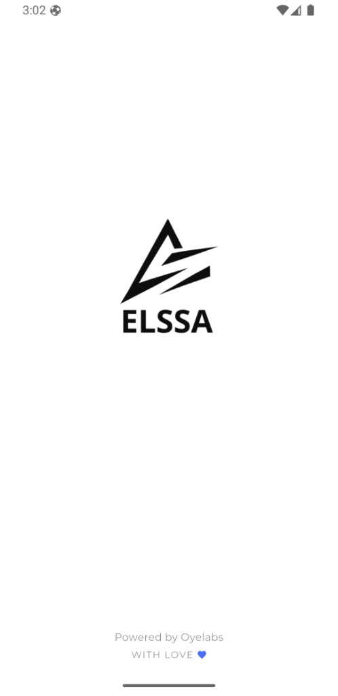</td>
    <td align="center">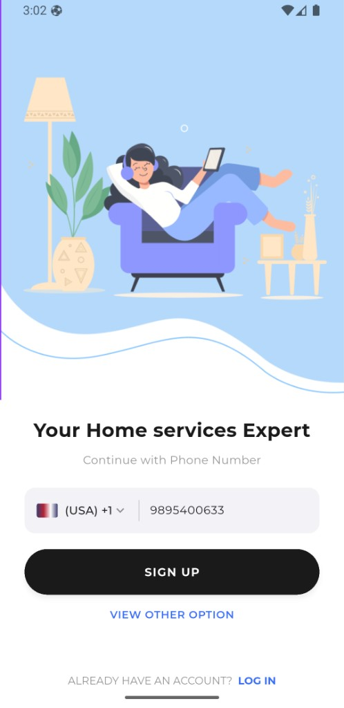</td>
    <td align="center">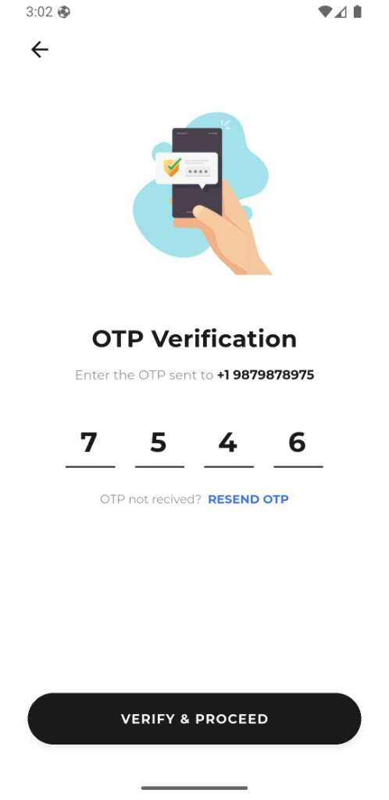</td>
  </tr>
  <tr>
    <td align="center"><b>Location</b></td>
    <td align="center"><b>Login</b></td>
    <td align="center"><b>Google Sign-In</b></td>
  </tr>
  <tr>
    <td align="center">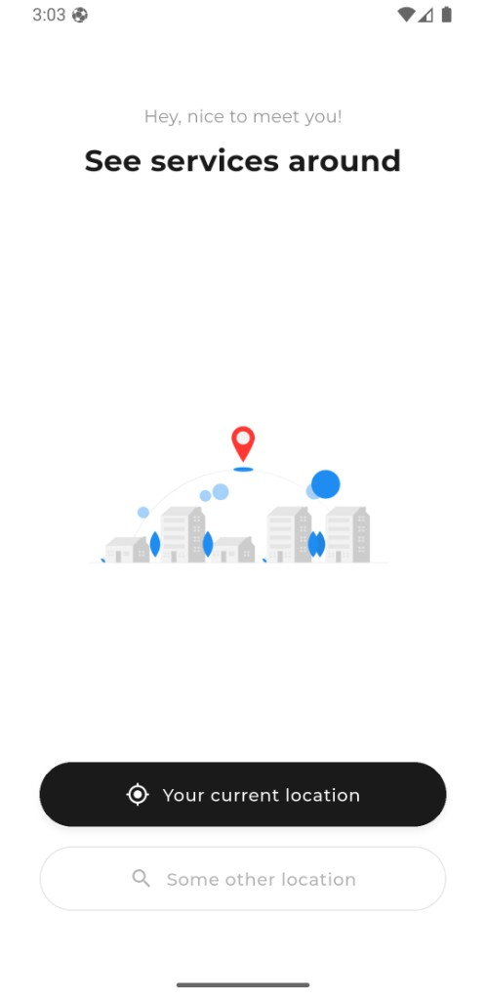</td>
    <td align="center">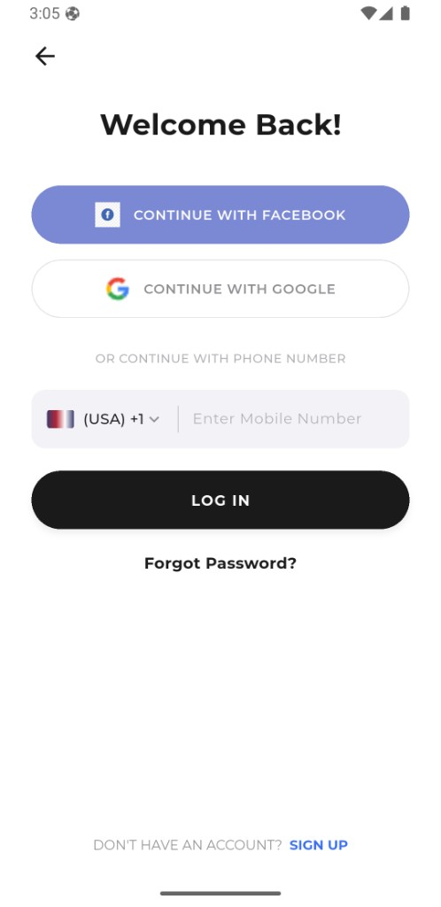</td>
    <td align="center">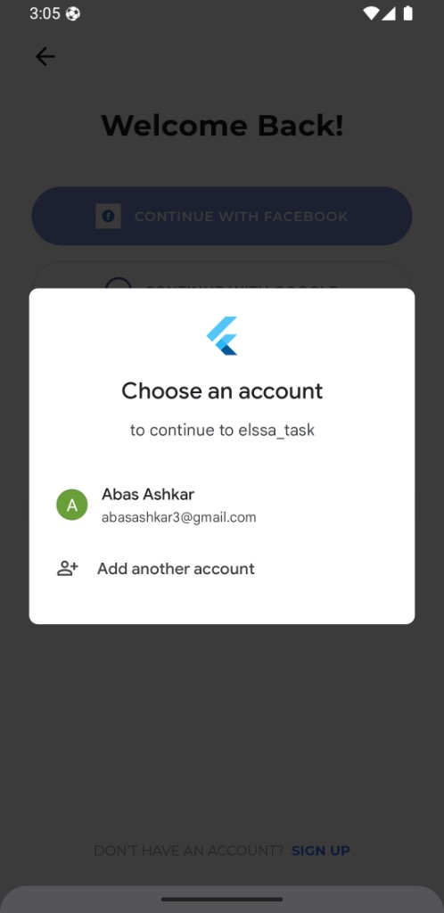</td>
  </tr>
  <tr>
    <td align="center"><b>Home — Banner & Grid</b></td>
    <td align="center"><b>Home — Services</b></td>
    <td align="center"><b>Profile</b></td>
  </tr>
  <tr>
    <td align="center">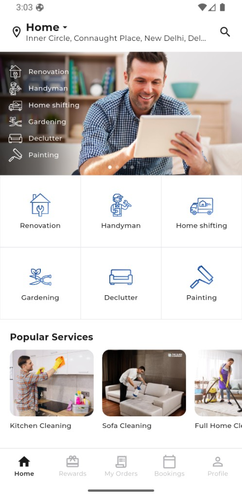</td>
    <td align="center">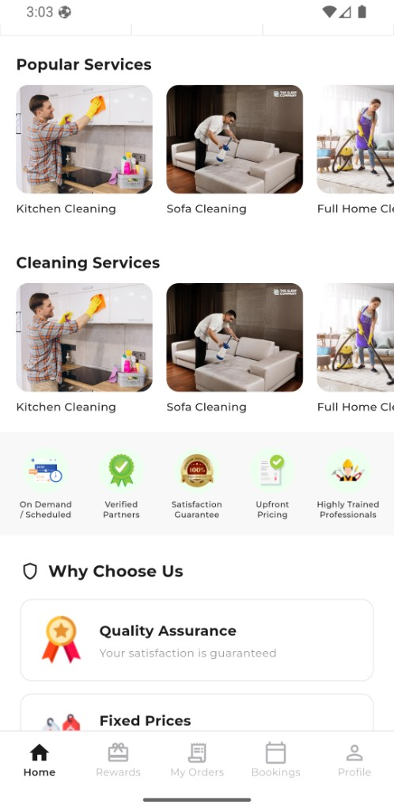</td>
    <td align="center">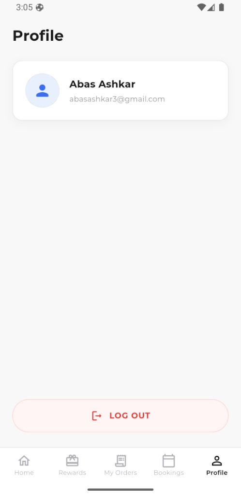</td>
  </tr>
  <tr>
    <td align="center"><b>Why Choose Us</b></td>
    <td align="center"><b>Safety & Footer</b></td>
    <td align="center"><b>Google Account Picker</b></td>
  </tr>
  <tr>
    <td align="center">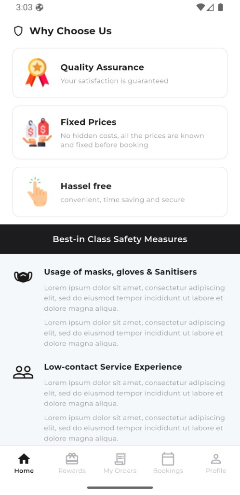</td>
    <td align="center">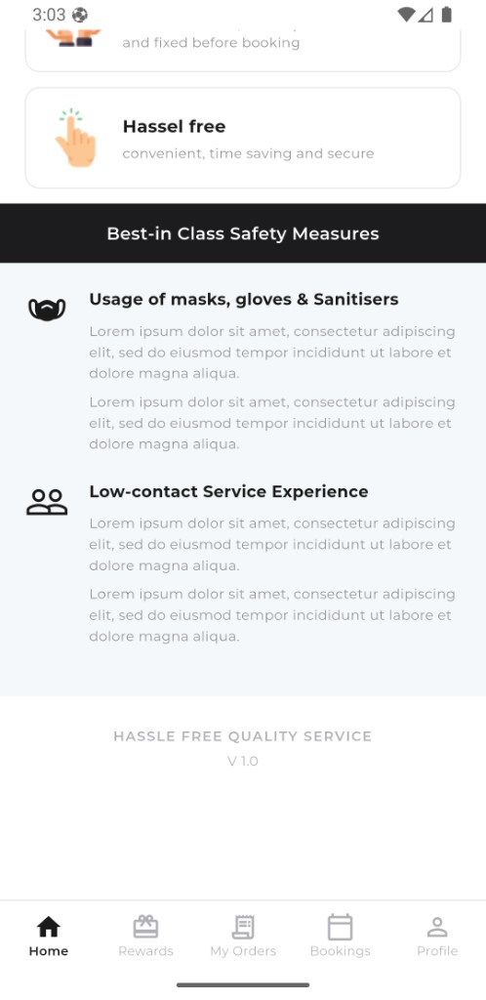</td>
    <td align="center"></td>
  </tr>
</table>

---

## Features

| Feature | Description |
|---------|-------------|
| Splash Screen | Branded launch screen with auto-navigation |
| Phone Sign Up | Phone number input with OTP verification flow |
| Google Sign-In | Firebase Authentication with Google (login & sign-up) |
| Location Setup | Choose current or custom service location |
| Home Dashboard | Banner carousel, service grid, popular & cleaning services |
| Trust Badges | On-demand, verified partners, satisfaction guarantee & more |
| Why Choose Us | Quality assurance, fixed prices, hassle-free service cards |
| Safety Measures | Best-in-class safety information section |
| Bottom Navigation | Home, Rewards, My Orders, Bookings, Profile tabs |
| Profile & Logout | User info from Firebase + secure logout |

---

## Tech Stack

| Category | Packages |
|----------|----------|
| Framework | Flutter 3.41.6 (FVM) |
| Language | Dart |
| Auth | `firebase_core`, `firebase_auth`, `google_sign_in` |
| UI | `google_fonts`, `flutter_svg`, `carousel_slider` |
| Font | Montserrat (bundled locally) |

---

## Project Structure

```
lib/
├── core/
│   ├── constants/     # Routes, asset paths
│   └── theme/         # Colors, app theme
├── screens/
│   ├── auth/          # Sign up, login, OTP
│   ├── home/          # Home screen & main shell
│   ├── location/      # Location picker
│   ├── profile/       # Profile & logout
│   └── splash/        # Splash screen
├── services/          # Firebase auth service
├── widgets/           # Reusable UI components
├── firebase_options.dart
└── main.dart
```

---

## Getting Started

### Prerequisites

- [Flutter SDK 3.41.6](https://docs.flutter.dev/get-started/install) (recommended via [FVM](https://fvm.app/))
- Android Studio / Xcode (for emulators)
- Firebase project with Google Sign-In enabled

### Installation

```bash
# Clone the repository
git clone <your-repo-url>
cd elssa_task

# Install Flutter version (if using FVM)
fvm install
fvm use

# Get dependencies
fvm flutter pub get

# Run the app
fvm flutter run
```

### Firebase Setup

1. Create a Firebase project at [console.firebase.google.com](https://console.firebase.google.com)
2. Enable **Google** under Authentication → Sign-in method
3. Run FlutterFire CLI:
   ```bash
   flutterfire configure
   ```
4. Add your **SHA-1** fingerprint to Firebase (Project Settings → Android app):
   ```bash
   keytool -list -v -keystore ~/.android/debug.keystore -alias androiddebugkey -storepass android -keypass android
   ```
5. Download updated `google-services.json` → place in `android/app/`

---

## Build APK

```bash
fvm flutter build apk --release
```

Output: `build/app/outputs/flutter-apk/app-release.apk`

**Pre-built APK:** [Download from Google Drive](https://drive.google.com/file/d/1nDZ7uDLkdoWVfZjAtkV6a_ExEwod3RHj/view?usp=share_link)

> **Note:** For release builds signed with a custom keystore, add that keystore's SHA-1 to Firebase as well.

---

## Navigation Flow

```
Splash → Sign Up → OTP → Location → Home
                ↘ Login → (Google / Phone) → Location → Home
                                                      ↘ Profile → Logout → Login
```

---

## Screens Implemented

- [x] Splash Screen
- [x] Sign Up
- [x] Login (Facebook UI + Google Sign-In)
- [x] OTP Verification
- [x] Location
- [x] Home (carousel, services, trust badges, why choose us, safety)
- [x] Bottom Navigation Shell
- [x] Profile with Logout
- [ ] Rewards, My Orders, Bookings (placeholder tabs)

---

## Assets

| Folder | Contents |
|--------|----------|
| `assets/images/` | Illustrations, logos, service photos |
| `assets/icons/` | SVG service icons & trust badge icons |
| `assets/fonts/` | Montserrat font family |
| `docs/screenshots/` | App screenshots for documentation |

---
